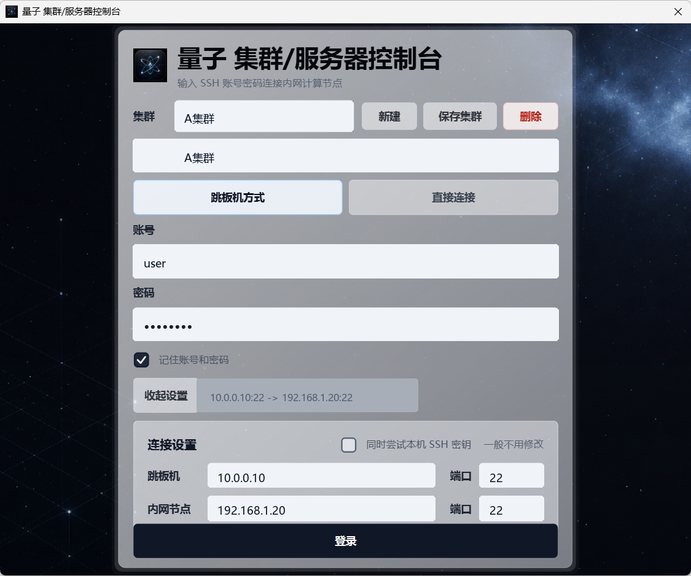
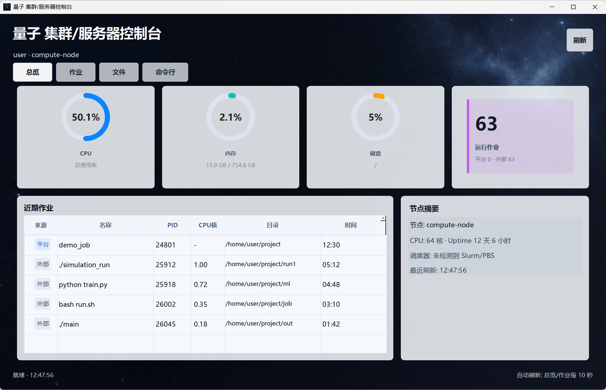
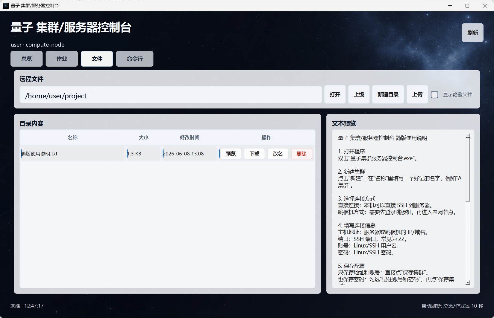

<div align="center">
  
  <h1>Cluster Management Platform: Quantum</h1>
  <p><strong>量子 集群/服务器控制台</strong></p>
  <p>一个轻量、开源、Windows 原生的 SSH 集群/服务器管理工具</p>
  <p>
    中文 | <a href="./README.en.md">English</a>
  </p>
  <p>
    <a href="https://github.com/Jiangsese/cluster-management-platform-quantum/releases/latest"></a>
    <a href="./LICENSE"></a>
    
    
    
    
    
  </p>
</div>

---

一个轻量、开源、Windows 原生的 SSH 集群/服务器管理工具。它适合没有 Slurm/PBS 等调度系统的小型 Linux 服务器、实验室集群、团队工作站或个人远程计算节点。
只是随便起了个名字叫量子，并不代表它和量子计算什么高大上的东西有关^^。
程序启动后是一个本地桌面窗口；默认不连接任何服务器，也不内置任何集群地址、账号、密码或私钥。

## 功能

- 多集群配置：每个集群可单独保存名称、连接方式、地址、账号和可选密码。
- 直接 SSH：适用于本机可以直接访问目标服务器的情况。
- 跳板机 SSH：适用于需要先登录跳板机，再进入内网计算节点的情况。
- 资源总览：查看 CPU、内存、磁盘、负载、运行时间和节点基础信息。
- 轻量作业管理：不依赖 Slurm/PBS，也不需要 root 权限。
- 外部任务识别：显示同一 Linux 账号从其他 SSH 客户端或脚本启动的计算进程。
- 真实停止按钮：平台作业和可见外部任务都可以执行停止操作。
- 文件管理：通过 SFTP 浏览、上传、下载、预览文本、改名、删除文件或空目录。
- 命令行面板：执行普通 Linux 命令，例如 `pwd`、`ls -lh`、`cd project`、`tail out.txt`。
- 可选本机加密保存密码：勾选“记住账号和密码”时，密码使用 Windows 当前用户的数据保护能力保存。

## 下载

从 GitHub Releases 下载 Windows 压缩包：

```text
QuantumClusterConsole-windows-x64.zip
```

解压后双击：

```text
量子集群服务器控制台.exe
```

建议保留整个解压后的文件夹，不要只复制单个 exe，因为程序还需要旁边的运行库文件。

## 界面预览

登录与多集群配置：



资源总览与作业识别：



文件管理与文本预览：



## 快速使用

1. 打开程序。
2. 点击 `新建`，给集群起一个名字，例如 `A集群`。
3. 选择 `直接连接` 或 `跳板机方式`。
4. 填写主机地址、SSH 端口、Linux 账号和密码。
5. 如果希望下次自动填充，勾选 `记住账号和密码`，再保存集群。
6. 点击 `登录` 进入控制台。

## 连接方式

直接连接：

```text
本机 Windows 电脑 -> Linux 服务器
```

跳板机方式：

```text
本机 Windows 电脑 -> 跳板机 -> 内网计算节点
```

如果目标服务器可以从本机直接访问，使用直接连接；如果计算节点在内网，需要先经过跳板机，使用跳板机方式。

## 作业说明

本工具不依赖 Slurm/PBS。通过 `作业` 页提交的命令会在远程用户目录下用一个轻量 registry 管理：

```text
~/.cluster_panel/
```

作业表会合并显示两类任务：

- `平台`：通过本软件提交的任务，支持状态、stdout/stderr 日志和停止按钮。
- `外部`：同一账号从其他 SSH 客户端、nohup 或脚本启动的计算进程，支持显示 PID、近似 CPU 核数、运行时间、工作目录和停止按钮。

外部任务不一定能恢复 stdout/stderr。如果输出已经重定向到文件，可以在文件页或命令行面板里查看。

## 命令行面板

命令行面板适合普通 shell 命令，会通过当前 SSH 会话真实执行，并保留 `cd` 后的当前目录。

适合：

```bash
pwd
ls -lh
cd project
tail -n 50 out.txt
```

它不是完整 PTY 终端，不建议直接运行 `vim`、`top`、`htop`、`less` 这类全屏交互程序。长时间计算建议使用作业页，或者自行运行：

```bash
nohup python run.py > out.txt 2>&1 &
```

## 安全声明

- 不内置服务器地址、账号、密码或私钥。
- 当前程序是本地桌面程序，不通过网页前端暴露密码。
- 默认不保存密码。
- 保存密码时只保存在当前 Windows 用户上下文中。
- 不需要 sudo。
- 不安装远程系统服务。
- 远程文件只有在用户主动点击上传、改名、删除、新建时才会变化。

## 从源码运行

```powershell
git clone https://github.com/Jiangsese/cluster-management-platform-quantum.git
cd cluster-management-platform-quantum
python -m venv .venv
.\.venv\Scripts\python.exe -m pip install -r requirements.txt
.\run_dev.ps1
```

## 打包 Windows 程序

```powershell
.\build_exe.ps1
```

打包结果位于：

```text
dist\量子集群服务器控制台\量子集群服务器控制台.exe
```

## 源码结构

- `native_app.py`：PySide6 原生桌面界面。
- `backend/app/ssh_client.py`：直接连接和跳板机 SSH 连接层。
- `backend/app/remote.py`：远程资源、作业、文件、命令行和进程操作。
- `backend/app/sessions.py`：登录凭据和会话数据结构。
- `backend/app/config.py`：应用路径和默认配置。
- `assets/`：软件图标和背景资源。
- `tests/`：单元测试。

## 测试

```powershell
python -m pytest -q
```

## 许可证

MIT License

## 写在最后

这个项目本意只是想给自己课题组的小服务器写一个可视化管理入口和平台，后来发现改一改也可以成为一个更通用的 SSH 集群/服务器控制台，所以就开源放在这里。任何人都可以自由修改和使用。
美工和图标主要依靠 image2，底层逻辑的实现绝大部分由 Codex 协助优化。
